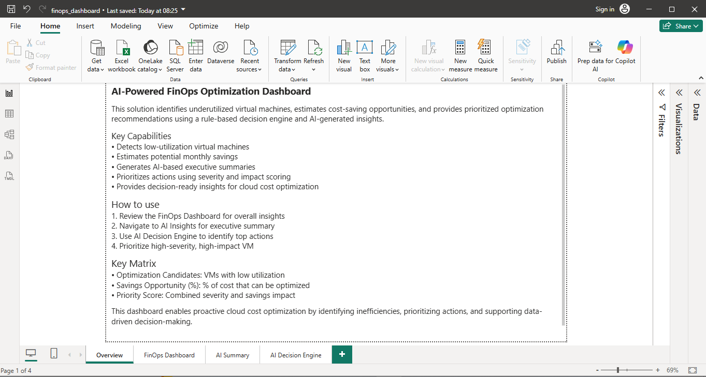
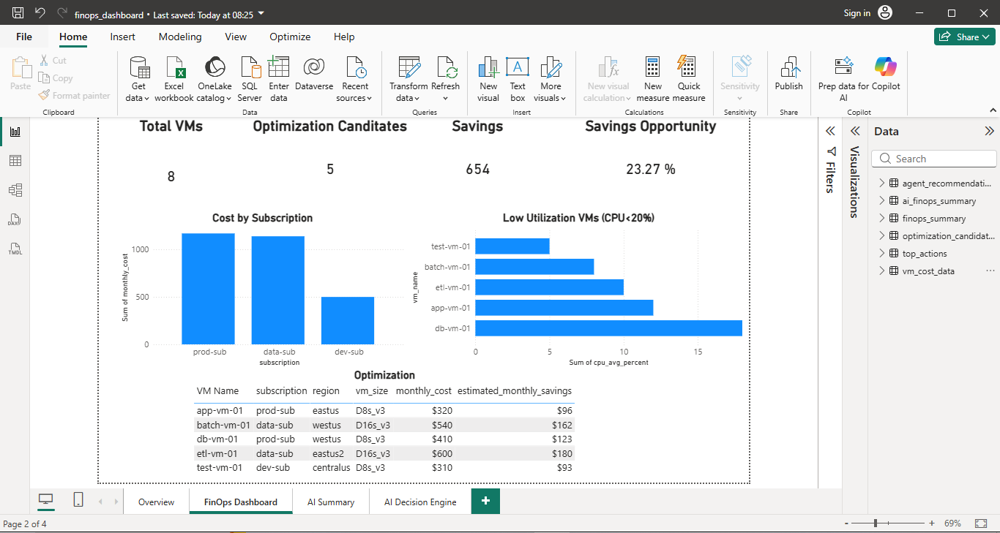
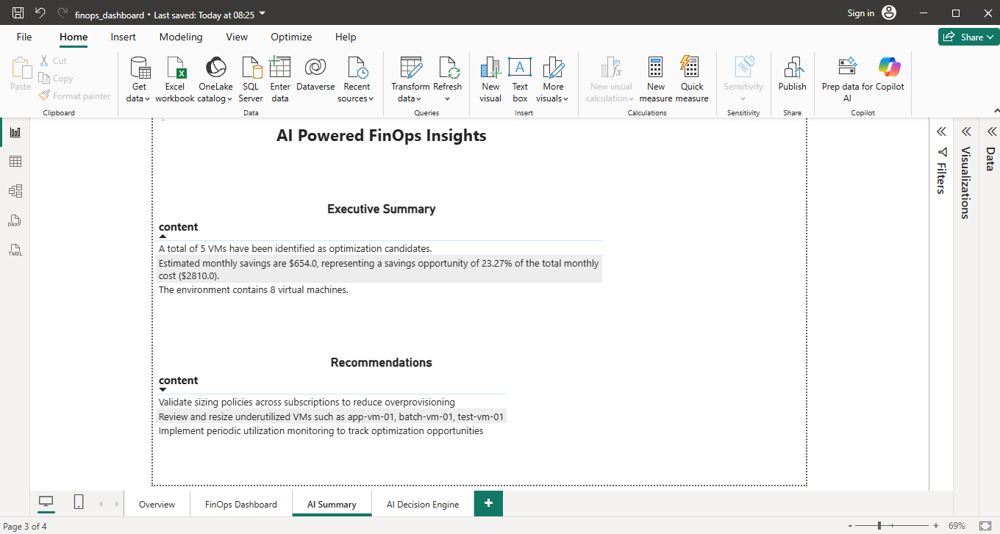
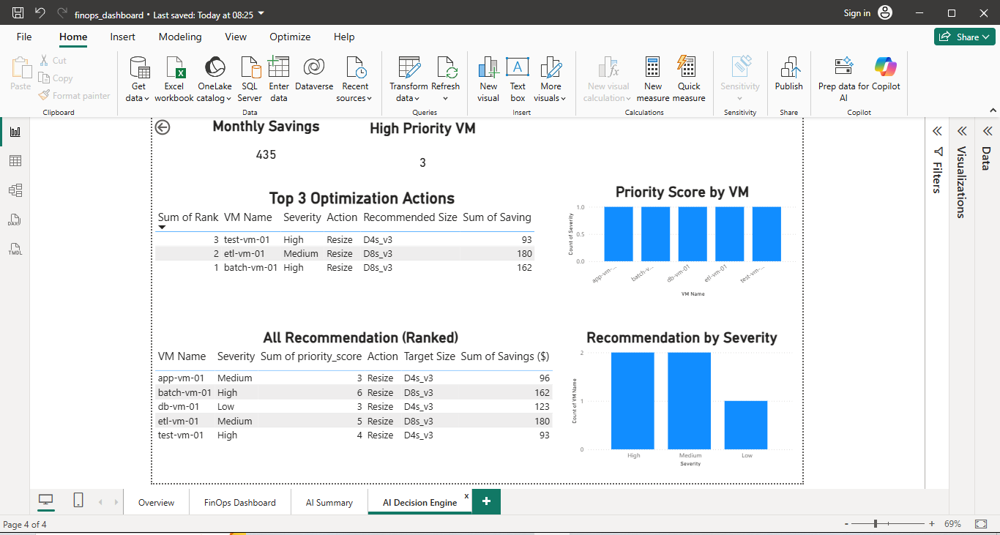

# AI FinOps Lab

A hands-on personal lab project combining Python, Power BI, GitHub, and OpenAI for FinOps-style cloud cost analysis.

## Architecture

VM Cost Data (CSV)
        ↓
Python Analysis Engine
        ↓
Optimization Candidates + FinOps Summary
        ↓
Power BI Dashboard
        ↓
OpenAI Executive Summary

## Features
- Reads VM cost and utilization data
- Identifies low-utilization VMs
- Estimates monthly savings opportunities
- Generates summary datasets for reporting
- Builds a Power BI dashboard
- Uses OpenAI to generate an executive FinOps summary

## Project Structure
- `data/` → source and output CSV files
- `src/` → Python scripts
- `docs/` → generated summaries
- `powerbi/` → dashboard file
- `terraform/` → reserved for infra-as-code work

## Current Workflow
1. Run `python src/analyze_cost.py`
2. Refresh Power BI dashboard
3. Run `python src/ai_finops_summary.py`
4. Run `python run_pipeline.py`

## Outputs
- Optimization candidate dataset
- FinOps summary dataset
- Power BI dashboard
- AI-generated executive summary

## Tech Stack
- Python
- Power BI
- OpenAI API
- GitHub
- Terraform

## Skills Demonstrated
- Python data processing
- FinOps-style cost analysis
- Power BI dashboard development
- OpenAI API integration
- GitHub project structuring
- Cloud optimization reporting

## Run the project

 Run `python run_pipeline.py`

## Dashboard Preview

 ## Power BI Dashboard

The Power BI report is not shared publicly due to best practices around data and model governance.

However, key insights and visuals are provided via screenshots in the repository.

The dashboard can be recreated using the provided dataset and measures